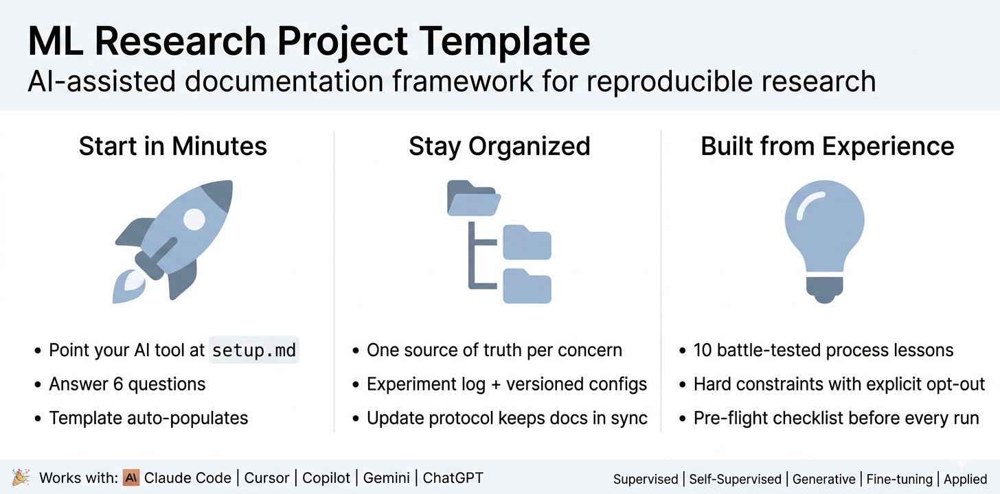

# ML Research Project Template

AI-assisted documentation and process framework for reproducible ML research.



## Getting Started

### 1. Get the template

**Option A: Clone and start fresh**
```bash
git clone https://github.com/pr4deepr/ml-research-template.git my-project
cd my-project
rm -rf .git
git init
```

**Option B: Download manually**

Go to the [repository page](https://github.com/pr4deepr/ml-research-template), click **Code > Download ZIP**, and extract the contents into your project folder.

### 2. Set up with your AI tool

Open your project folder in your AI coding tool, then tell it: **"Read setup.md and help me set up this project"**

**Claude Code (CLI):**
```bash
cd my-project
claude
```

**Claude Code (Desktop app or VS Code / JetBrains extension):** Open the project folder, then start a new conversation.

**Other tools (Cursor, Copilot, Windsurf, etc.):** Open the project folder in the editor -- the AI assistant will automatically pick up the template files.

That's it. The AI reads your answers and fills in CLAUDE.md, methodology, experiment roadmap, and everything else. You review and adjust.

> **No AI tool?** Fill in `setup.md` manually, then use it as a reference to populate the template files yourself. Start with CLAUDE.md, then methodology.md, then experiment_roadmap.md.

## What to Fill In When

| When | Files | Why |
|------|-------|-----|
| **Day 1** | CLAUDE.md, user_role.md, environment.yml, setup.md, methodology.md (scaffold) | Define the project |
| **After first experiment** | methodology.md (refine metrics), EXPERIMENT_LOG.md | Lock in eval protocol |
| **Ongoing** | architecture_decisions.md, experiment_roadmap.md, CHANGELOG.md | Track decisions |
| **Mid/late project** | critical_assessment.md, retrospective.md, manuscript/ | Reflect and write up |

## Structure

```
project/
├── CLAUDE.md                       # Navigation hub (start here)
├── README.md                       # This file
├── setup.md                        # Project setup questionnaire
├── CHANGELOG.md                    # Chronological decisions
├── environment.yml                 # Conda environment
├── data/
│   └── README.md                   # Data provenance
├── docs/
│   ├── methodology.md              # Eval metrics, protocol, constraints
│   ├── architecture_decisions.md   # Choices with evidence
│   ├── experiment_roadmap.md       # What to run and why
│   ├── critical_assessment.md      # Honest limitations
│   └── retrospective.md           # Lessons learned
├── evaluation/
│   └── README.md                   # Shared eval code principles
├── experiments/
│   ├── EXPERIMENT_LOG.md           # ALL results, one file
│   └── configs/                    # YAML config per experiment
│       └── README.md               # Config format guide
├── references/                     # External feedback & literature
│   └── README.md                   # What goes here
├── manuscript/
│   └── paper_outline.md            # Paper structure
└── memory/                         # Cross-session context
    ├── MEMORY.md                   # Index
    ├── project_key_learnings.md    # Full narrative
    └── user_role.md                # User background
```

## Customization by Project Type

The AI assistant will adjust the template based on your project type. Here's what changes:

### Supervised Learning (classification / regression)

- **Metrics:** accuracy, F1, AUC as primary; cross-validation protocol
- **Workflow:** baseline > hyperparameter search > ablations > final eval
- **Constraints emphasis:** stratified splits, class imbalance handling
- **Relax:** screening constraint if dataset is small enough for fast full runs
- **Suggested first experiment:** train baseline model, establish metric floor

### Self-Supervised / Unsupervised Learning

- **Metrics:** downstream probe as primary (not pretraining loss), random-init baseline required
- **Workflow:** pretraining screen > probe evaluation > representation analysis
- **Constraints emphasis:** proxy metric warning (training loss != feature quality), effective N for clustering
- **Skip:** manuscript/ sections on supervised baselines if not applicable
- **Suggested first experiment:** train with default config, evaluate with linear probe vs random init

### Generative Models (diffusion, GANs, VAEs)

- **Metrics:** FID/IS + human eval, sample diversity metrics
- **Workflow:** architecture search > training stability > quality eval > ablations
- **Constraints emphasis:** cherry-picking warning (always show random samples), compute budget for sampling
- **Relax:** "single primary metric" constraint -- generative quality is inherently multi-metric
- **Suggested first experiment:** train baseline generator, compute FID on held-out set

### Fine-tuning / Transfer Learning (LLMs, foundation models)

- **Metrics:** downstream task metrics, catastrophic forgetting checks
- **Workflow:** baseline (zero-shot) > prompt engineering > fine-tune > eval
- **Constraints emphasis:** data contamination checks, eval set leakage, cost tracking
- **Skip:** architecture_decisions.md if using a frozen pretrained model; experiment_roadmap.md tiers if iterating on prompts
- **Suggested first experiment:** zero-shot baseline on your eval set

### Applied / Engineering (deployment-focused)

- **Metrics:** latency, throughput, accuracy-at-threshold
- **Workflow:** baseline > optimization > A/B test > deploy
- **Constraints emphasis:** production-readiness, reproducibility across environments
- **Skip:** manuscript/ (unless writing a technical report), retrospective Part B (unless novel findings)
- **Suggested first experiment:** benchmark current system, establish performance baseline

## Core Principles

### 1. One source of truth per information type
Results > EXPERIMENT_LOG.md. Decisions > architecture_decisions.md. Status > CLAUDE.md. Methodology > methodology.md.

### 2. Navigation hub, not monolith
CLAUDE.md links to everything but stays under ~100-150 lines.

### 3. Save incrementally, skip existing
Never lose progress to crashes. Save results per experiment. On restart, skip what's done.

### 4. Always compare to baseline
Include random init / majority class / "doing nothing" in every evaluation. Without it, you can't tell if your method helps.

### 5. Report effective N
Independent samples != correlated observations. Know your independent unit.

### 6. Map experiments to deliverables
Every experiment serves a paper section or a decision. If it doesn't, don't run it.

### 7. Update protocol
When something changes, CLAUDE.md's Update Protocol tells you which files need updating.

### 8. Test the eval, not just the model
The evaluation code is what you make decisions from. If it has a bug, every decision downstream is wrong.

### 9. Document WHY, not just WHAT
"We use X because screen showed Y" beats "We use X."

### 10. Memory for cross-session continuity
project_key_learnings.md is a handoff to a colleague who's never seen the project.

## What This Template Does NOT Include

- Model code (project-specific)
- Data loading (project-specific)
- Training loops (project-specific)
- CI/CD configuration
- Metric visualization (use W&B/TensorBoard when complexity demands it)

The template provides documentation and process structure around whatever code you write.

## Using With Other AI Tools

This template is designed for Claude Code but 90% is model-agnostic markdown. Only the `memory/` directory and `CLAUDE.md` filename are Claude-specific.

| Tool | Changes needed |
|------|---------------|
| **ChatGPT** | Rename `CLAUDE.md` > `PROJECT.md`. Copy `memory/project_key_learnings.md` into Custom Instructions. |
| **Gemini CLI** | Rename `CLAUDE.md` > `GEMINI.md`. Memory files work as context docs. |
| **Cursor** | Rename `CLAUDE.md` > `.cursorrules`. Memory files > paste into project context. |
| **Copilot / Windsurf** | Rename `CLAUDE.md` > `AGENTS.md`. Same structure works. |
| **Open source (Ollama, etc.)** | No persistent memory. Paste `project_key_learnings.md` into system prompt each session. |

The setup.md questionnaire works with any AI tool that can read files.

### What's universal vs Claude-specific

| Component | Universal | Claude-specific |
|-----------|----------|----------------|
| All `docs/`, `experiments/`, `manuscript/`, `data/`, `references/` | Yes | -- |
| Update Protocol, Core Principles | Yes | -- |
| `.gitignore`, `environment.yml`, `CHANGELOG.md` | Yes | -- |
| `CLAUDE.md` (navigation hub) | Concept is universal | Filename and session startup |
| `memory/` (persistent context) | Concept is universal | YAML frontmatter, auto-loading |

## Origin

Built during a real ML research project (2026-04-03 to 2026-04-06), then generalized. Every pattern solves a real problem: orphaned GPU processes, lost experiment results, stale docs, wrong metrics, inflated sample sizes, and context loss between sessions.
